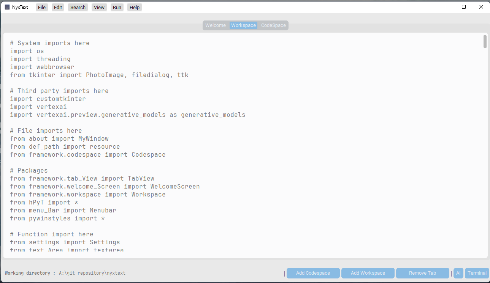

<h3 align="center">
	<br/>
    
    Nyxtext
	
</h3>

<h6 align="center">
  <a href="https://github.com/parazeeknova/nyxtext#note-">Info</a>
  ·
  <a href="https://github.com//parazeeknova/nyxtext#-installing-nyxtext">Install</a>
  ·
  <a href="https://github.com//parazeeknova/nyxtext#-early-editor-screenshots">Showcase</a>
  ·
  <a href="https://github.com/parazeeknova/nyxtext#-contributing">Contribution</a>
  ·
  <a href="https://github.com/parazeeknova/nyxtext#-support">Support</a>

</h6>

<p align="center">
  
</p>

&nbsp;

<p align="center">
	<a href="https://github.com/parazeeknova/nyxtext/stargazers">
		</a>
	<a href="https://github.com/parazeeknova/nyxtext/issues">
		</a>
    <a href="https://github.com/catppuccin/catppuccin/releases/latest">
    </a>
		</a>
</p>

<div align="center">

 

</div>

&nbsp;

<p align="center">
<b>NyxText</b> is a basic text editor built using Python, <b>Tkinter and Custom Tkinter</b>, featuring the elegant <b>Catppuccin color scheme</b> and the minimalist <b>Paperus icon theme</b>. This project represents a collaboration effort, with each element of the text editor organized into separate files for clarity and maintainability, also a ai powered desktop application that offers a comprehensive text editor for creatives, developers, and students alike.
</p> 

<p align="center">
  <a href="https://github.com/parazeeknova/nyxtext">
    <picture>
      <source srcset="assets/social/macchiato_github.svg" width="64" height="64" alt="Github Logo" media="(prefers-color-scheme: dark)"/>
      <source srcset="assets/social/latte_github.svg" width="64" height="64" alt="Github Logo" media="(prefers-color-scheme: light), (prefers-color-scheme: no-preference)"/>
      
    </picture>
  </a>
  
  <a href="https://discord.gg/UwmqqXkV">
    <picture>
      <source srcset="assets/social/macchiato_discord.svg" width="64" height="64" alt="Discord Logo" media="(prefers-color-scheme: dark)"/>
      <source srcset="assets/social/latte_discord.svg" width="64" height="64" alt="Discord Logo" media="(prefers-color-scheme: light), (prefers-color-scheme: no-preference)"/>
      
    </picture>
  </a>
  
  <a href="https://twitter.com/hashcodes_">
    <picture>
      <source srcset="assets/social/macchiato_twitter.svg" width="64" height="64" alt="Twitter Logo" media="(prefers-color-scheme: dark)"/>
      <source srcset="assets/social/latte_twitter.svg" width="64" height="64" alt="Twitter Logo" media="(prefers-color-scheme: light), (prefers-color-scheme: no-preference)"/>
      
    </picture>
  </a>
  
  <a href="https://www.reddit.com/user/parazeeknova">
    <picture>
      <source srcset="assets/social/macchiato_reddit.svg" width="64" height="64" alt="Reddit Logo" media="(prefers-color-scheme: dark)"/>
      <source srcset="assets/social/latte_reddit.svg" width="64" height="64" alt="Reddit Logo" media="(prefers-color-scheme: light), (prefers-color-scheme: no-preference)"/>
      
    </picture>
  </a>
</p>

---

> [!NOTE] 
> As the first project developed by a group of undergraduates, NyxNote is a work in progress. We appreciate any contributions, understanding that the project may have bugs, instability, and limited features during the time of active development. Please check back or join our Discord server to see our progress! 

### ✨ Installing Nyxtext

<details>

<summary>Debian-based Linux distributions (e.g. Ubuntu, Mint)</summary>

**Open a terminal and run these commands:**

```bash
git clone --depth 1 https://github.com/parazeeknova/nyxtext.git
sudo apt update
sudo apt install python3 python3-pip
python3 -m venv nyxtext
source nyxtext/bin/activate
pip install -r requirements.txt
python editor/scripts/main.py
```
</details>

<details>
<summary>Arch Linux</summary>

**To install NyxText on Arch Linux, you can follow these steps:**

```bash
sudo pacman -Sy python tk
git clone --depth 1 https://github.com/parazeeknova/nyxtext.git
cd nyxtext
python -m venv nyxtext
source nyxtext/bin/activate
pip install -r requirements.txt
python editor/scripts/main.py
```

</details>

<details>
<summary>MacOS</summary>

I don't have a Mac. If you have a Mac, you can help me a lot by installing
Nyxtext and letting me know how well it works.

</details>

<details>
<summary>Windows</summary>

Download Nyxtext from [the releases page](https://github.com/parazeeknova/nyxtext/releases) and extract it. Then run through `Nyxtext.exe`.

</details>

### 🧠 Design Philosophy

- **Simplicity**: Keep the user interface clean and intuitive. Avoid cluttering the interface with unnecessary features or options. Focus on providing essential functionality in an easy-to-use manner.
- **Customizability**: Provide users with options to customize the editor to suit their preferences.
- **Modularity**: Design the codebase to be modular and extensible.
- **Maintainability**: Keep the codebase maintainable and readable.
- **Community Engagement**: Foster a vibrant and inclusive community around the editor. Encourage users to provide feedback, report bugs, and contribute code.
- **Feature Rich**: Have all the basic features for a text editor

&nbsp;

### 🎨 Palette

**Catppuccin** consists of 4 beautiful pastel color palettes. \
Thats not it it also has some other custom made themes like **lumber** and **H2O**. \
The number of themes is not definite, we will be adding more in the future, Also you can make your **own**.
<p align="center">

<h>⚠️ Image referenced from Catppuccin's Repo</h> 
</p>

&nbsp;

### ✨Features :
- Edit Text files ~ duh.
- **Workspace** - Work on multiple text file simultaneously.
- **Syntax highlighting** - For the code space area.
- Catpuccin Color Palette themes(4) + 4 Custom made themes and counting on..
- **Dark / Light** mode.
- **Basic functions** (new,open,save,cut,copy, etc.) check **menu bar** for more..
- **FileTree** View which shows all your project's files & folders.
- **System scaling** support.
- **Responsive** design - 3 modes (windowed, middleman, fullscreen).
- **AI** assistence, shortcuts to Gemini, ChatGPT, BlackboxAI... 
- **Integrated Terminal** Supports all basic commands, highly customizable, supports multiple tabs to run simultaneously...
- **Integrated Gemini**: Includes a powerful search bar powered by the Gemini API for easy access to code and content.
- ***More Soon...***

&nbsp;

### 💡Future Plans : 
- [x] ~~Complete rebase to custom_tkinter~~ - Done 28/02/2024 ✅
- [x] ~~Integrated Gemini AI~~ - Done 27/04/2024 ✅
- [ ] Auto completion, Grammer check
- [x] ~~Filetree viewer~~ - Done 02/03/2024 ✅
- [ ] Spell Check
- [x] ~~Syntax Highlighter~~ - Done 09/03/2024  ✅ ~ Used [Chlorophyll](https://github.com/rdbende/chlorophyll)
- [ ] Search & replace 
- [ ] Split file viewer, comparasion window
- [ ] Focus window
- [ ] Undo / Redo
- [ ] Working Settings page
- [x] ~~Terminal Support~~ - Done ✅ ~ Intergated [TkTerm](https://github.com/dhanoosu/TkTerm)
- [ ] Text Formatting - (Bold, Underline, Bulletpoints)
- [ ] Basic file Encryption / Decryption
- [ ] Hyperlinks, Markdown support
- [ ] Auto completion when pressing Tab for Codespace
- [ ] Git support
- [ ] Running files in a separate terminal or command prompt window
- [ ] Automatic indenting and trailing whitespace stripping when Enter is pressed
- [ ] Line length marker
- [ ] Code folding
- [ ] Multiple files can be opened at the same time like tabs in a web browser
- [ ] The tabs can be dragged out of the window to open a new window

&nbsp;

| Different Flavours (as of α-0.0.1v ) | Cattppuccin Color Scheme (as of α-0.0.5v ) | Frappe Flavour (as of α-0.0.5v ) | Macchiato code (as of α-0.0.5v ) |
|--------------------------------------|--------------------------------------------|---------------------------------|---------------------------------|
|  |  |  |  |
| Default Light (as of α-0.0.5v ) | Default Dark Windowed (as of α-0.0.5v ) | | |
|  |  | | |

&nbsp;

---
### 🐜 Bugs : 
- [x] ~~It's not responsive as the project is still in early development.~~ - Done 08/03/2024 ✅
- [x] ~~The editor only works in the full screen at the moment.~~ - Done 08/03/2024  ✅ - Now has 3 modes
- [ ] Filetree cannot open files
- [ ] There is no dynamic heading.
- [ ] Search bar does not work.

- Currently the codebase is not modular and contains a lot of redundant code and is not optimized for performance, has two versions. First tkinter based and second custom tkinter based (hybrid).

---
### 🛹 Development : 


---

## ❓ FAQs:

### What's new in the latest NyxText release?

See [Releases](https://github.com/parazeeknova/nyxtext/releases).

<!-- ### Does NyxText support programming language X?
You will likely get syntax highlighting without any configuring
and autocompletions with a few lines of configuration file editing. -->

### Help! NyxtText doesn't work.

Install all the python pip packages for alpha stage.
If it still doesn't work, [let me know by creating an issue on
GitHub](http://github.com/parazeeknova/nyxtext/issues/new).

### Is NyxText written in NyxText?

Not at the moment. We are writing the very first version in `Neovim`, but will use it when we are done with basic features.

### Why is it named NyxText?

1. **Mythological Inspiration:** `NyxText` draws upon the Greek goddess `Nyx`, associated with night, creation, and beginnings. This resonates with writers and programmers who often find inspiration during the quiet hours. The name subtly reflects this theme through its potential use of darker design elements.

2. **Euphony and Distinction:** `NyxText` possesses a pleasant sound with `Nyx` adding a touch of mystique. This name stands out from common text editors, making it both memorable and unique.

3. **Symbolic Alignment:**  `Nyx` can also symbolize the blank canvas or the void before creation. This perfectly aligns with the core function of a text editor - providing a blank slate for writers and programmers to bring their ideas to life.

### I want an editor that does X, but X is not in the feature list above. Does NyxText do X?
You can run NyxText and find out,
or [create an issue on GitHub](https://github.com/parazeeknova/nyxtext/issues/new) and ask.
If you manage to make us excited about X, We might implement it.

### Why did you create a new editor?
Because I can.

### Why did you create a new editor in tkinter or X?
Because I can.

### Why not use editor X?
Because Nyxtext is better.

---

### 👐 Contributing

> [!NOTE]<br>
> Thank you for considering contributing to NyxNote! We welcome contributions from everyone, whether you're fixing a bug, adding a feature, or improving documentation.

See [CONTRIBUTING.md](../docs/CONTRIBUTING.md)

&nbsp;

### 📜 License

NyxText is released under the MIT license:
For more convoluted language, see the [LICENSE](https://github.com/parazeeknova/nyxtext/blob/main/LICENSE).

&nbsp;

### 💖 Gratitude

Thanks to my Friends for the initial development of the project, contributing this project :

- [Og Noviciuss](https://github.com/noviciusss) (initial Developer)
- [Og Castimonia07](https://github.com/castimonia07) (initial Colorschemes)

&nbsp;

<p align="center"></p>
<div align="center">


</div>
<p align="center">Copyright &copy; 2024-present <a href="https://github.com/parazeeknova/nyxtext" target="_blank">NyxText</a>
<p align="center"><a href="https://github.com/parazeeknova/nyxtext/blob/main/LICENSE"></a></p>
