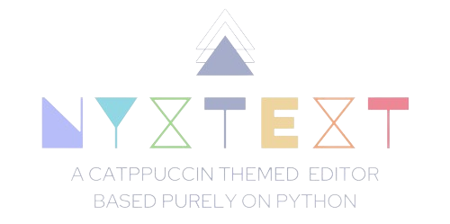
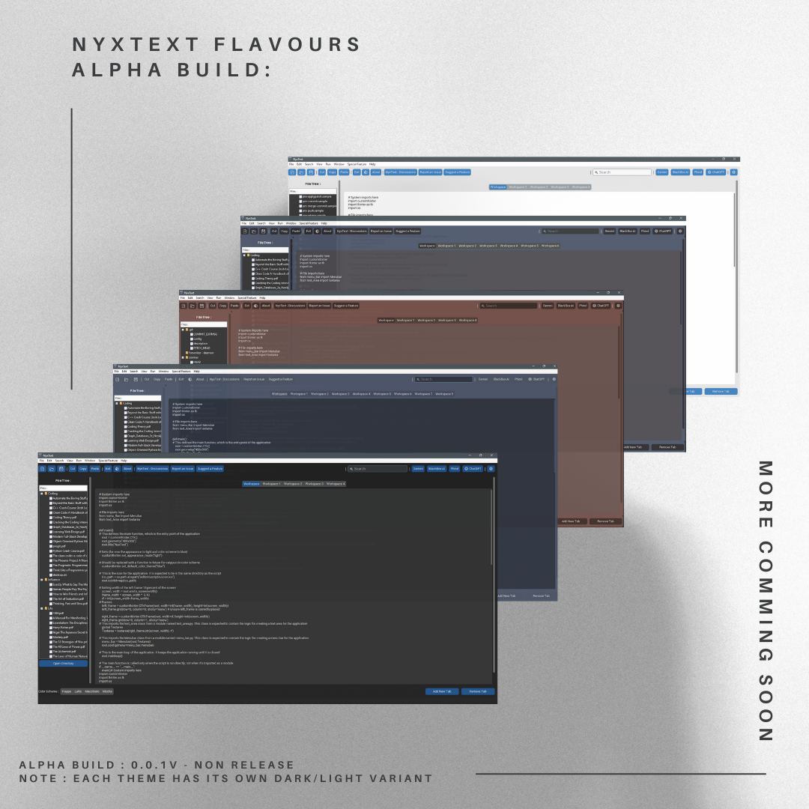
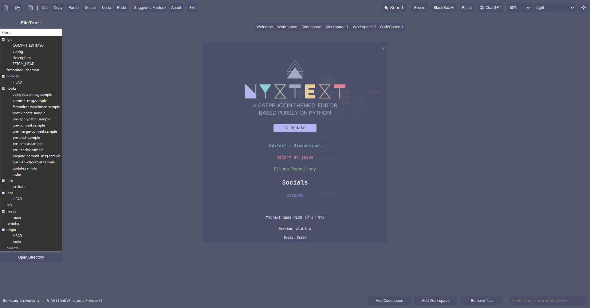
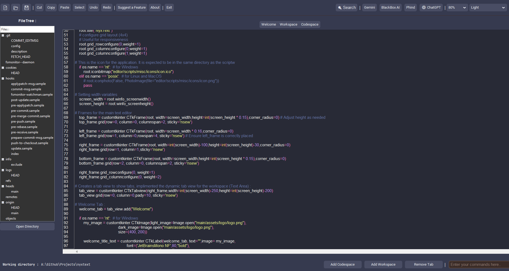
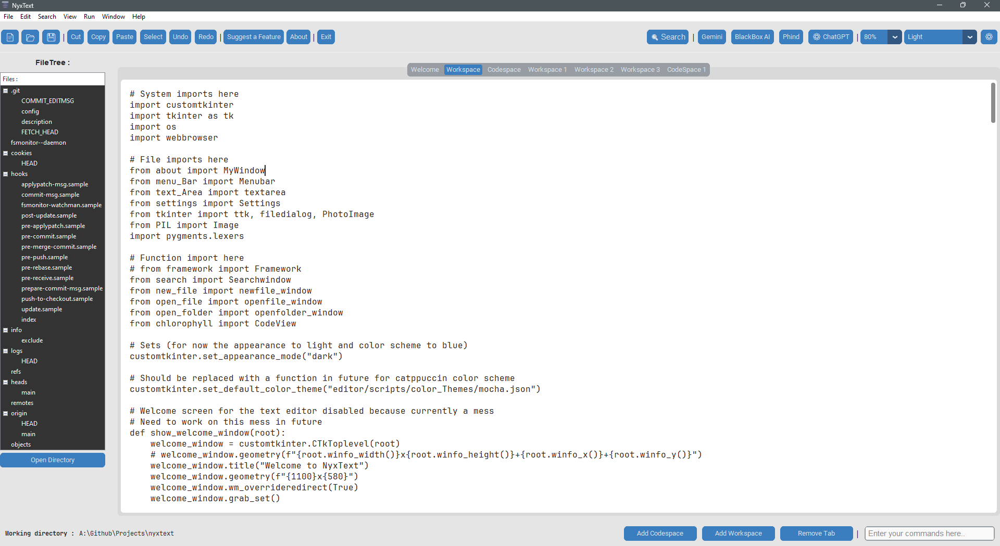
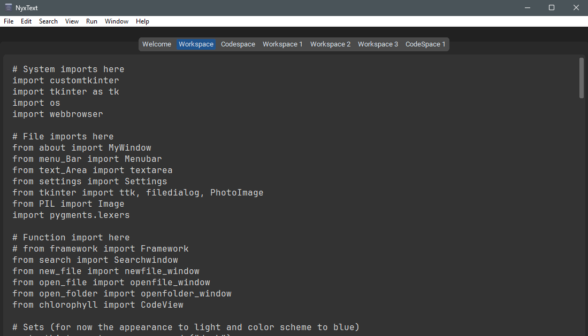
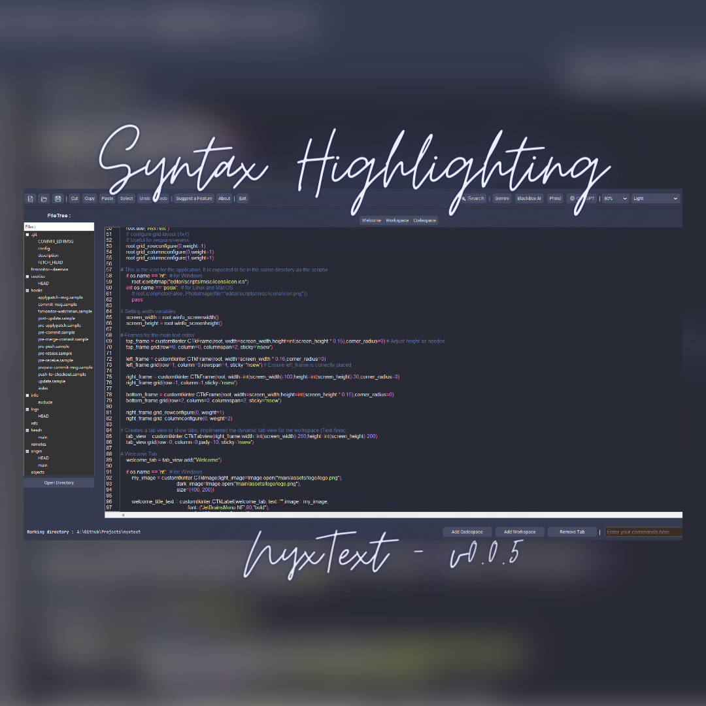

⚠️ **The Project is in very Early Development. Need to add/ rebase a lot of stuff!.**


<h3 align="center">
	<br/>
    
    Nyxtext
	
</h3>

<h6 align="center">
  <a href="https://github.com/parazeeknova/nyxtext#-info">Info</a>
  ·
  <a href="https://github.com//parazeeknova/nyxtext#-Note">About</a>
  ·
  <a href="https://github.com//parazeeknova/nyxtext#-Early editor screenshots">Showcase</a>
  ·
  <a href="https://github.com/parazeeknova/nyxtext/docs">Docs</a>
</h6>

<p align="center">
  
</p>

<p align="center">
	<a href="https://github.com/parazeeknova/nyxtext/stargazers">
		</a>
	<a href="https://github.com/parazeeknova/nyxtext/issues">
		</a>
    <a href="https://github.com/catppuccin/catppuccin/releases/latest">
		</a>
</p>

<div align="center">

[](https://docs.python.org/3/library/tkinter.html) 
</div>
&nbsp;
<p align="center">
<b>NyxText</b> is a basic text editor built using Python, <b>Tkinter and Custom Tkinter</b>, featuring the elegant <b>Catppuccin color scheme</b> and the minimalist <b>Paperus icon theme</b>. This project represents a collaboration effort, with each element of the text editor organized into separate files for clarity and maintainability.
</p> 

<p align="center">
  <a href="https://github.com/parazeeknova/nyxtext">
    <picture>
      <source srcset="main/assets/social/macchiato_github.svg" width="64" height="64" alt="Github Logo" media="(prefers-color-scheme: dark)"/>
      <source srcset="main/assets/social/latte_github.svg" width="64" height="64" alt="Github Logo" media="(prefers-color-scheme: light), (prefers-color-scheme: no-preference)"/>
      
    </picture>
  </a>
  
  <a href="https://discord.gg/UwmqqXkV">
    <picture>
      <source srcset="main/assets/social/macchiato_discord.svg" width="64" height="64" alt="Discord Logo" media="(prefers-color-scheme: dark)"/>
      <source srcset="main/assets/social/latte_discord.svg" width="64" height="64" alt="Discord Logo" media="(prefers-color-scheme: light), (prefers-color-scheme: no-preference)"/>
      
    </picture>
  </a>
  
  <a href="https://twitter.com/hashcodes_">
    <picture>
      <source srcset="main/assets/social/macchiato_twitter.svg" width="64" height="64" alt="Twitter Logo" media="(prefers-color-scheme: dark)"/>
      <source srcset="main/assets/social/latte_twitter.svg" width="64" height="64" alt="Twitter Logo" media="(prefers-color-scheme: light), (prefers-color-scheme: no-preference)"/>
      
    </picture>
  </a>
  
  <a href="https://www.reddit.com/user/parazeeknova">
    <picture>
      <source srcset="main/assets/social/macchiato_reddit.svg" width="64" height="64" alt="Reddit Logo" media="(prefers-color-scheme: dark)"/>
      <source srcset="main/assets/social/latte_reddit.svg" width="64" height="64" alt="Reddit Logo" media="(prefers-color-scheme: light), (prefers-color-scheme: no-preference)"/>
      
    </picture>
  </a>
</p>

<p align="center">
<b>Join our community!</b>
</p>

&nbsp;

---
### Note :  
As the first project developed by a group of undergraduates, NyxNote is a work in progress. We appreciate any contributions, understanding that the project may have bugs, instability, and limited features during the time of active development. Please check back or join our Discord server to see our progress!

### 🧠 Design Philosophy

- **Simplicity**: Keep the user interface clean and intuitive. Avoid cluttering the interface with unnecessary features or options. Focus on providing essential functionality in an easy-to-use manner.
- **Customizability**: Provide users with options to customize the editor to suit their preferences.
- **Modularity**: Design the codebase to be modular and extensible.
- **Maintainability**: Keep the codebase maintainable and readable.
- **Community Engagement**: Foster a vibrant and inclusive community around the editor. Encourage users to provide feedback, report bugs, and contribute code.
- **Feature Rich**: Have all the basic features for a text editor

&nbsp;

### 🎨 Palette

**Catppuccin** consists of 4 beautiful pastel color palettes. \
Thats not it it also has some other custom made themes like **lumber** and **H2O**. \
The number of themes is not definite, we will be adding more in the future, Also you can make your **own**.
<p align="center">

<h>⚠️ Image referenced from Catppuccin's Repo</h> 
</p>

&nbsp;
### ✨Features :
- Edit Text files ~ duh.
- **Workspace** - Work on multiple text file simultaneously.
- **Syntax highlighting** - For the code space area.
- Catpuccin Color Palette themes(4) + 4 Custom made themes and counting on..
- **Dark / Light** mode.
- Basic functions (new,open,save,cut,copy, etc.) check **menu bar** for more..
- **FileTree** View which shows all your project's files & folders.
- **System scaling** support.
- **Responsive** design - 3 modes (windowed, middleman, fullscreen).
- **AI** assistence, shortcuts to Gemini, ChatGPT, BlackboxAI... 
- ***More Soon...***

&nbsp;
### 💡Future Plans : 
- [x] ~~Complete rebase to custom_tkinter~~ - Done 28/02/2024 ✅
- [ ] Auto completion, Grammer check
- [x] ~~Filetree viewer~~ - Done 02/03/2024 ✅
- [ ] Spell Check
- [x] ~~Syntax Highlighter~~ - Done 09/03/2024  ✅ ~ Used [Chlorophyll](https://github.com/rdbende/chlorophyll)
- [ ] Search & replace 
- [ ] Split file viewer, comparasion window
- [ ] Focus window
- [ ] Undo / Redo
- [ ] Working Settings page
- [ ] Text Formatting - (Bold, Underline, Bulletpoints)
- [ ] Basic file Encryption / Decryption
- [ ] Hyperlinks, Markdown support
&nbsp;
---

### 🌟 Early Access :
Run ***main.py*** in **editor/scipts** to start the editor, project is very unstable at the moment and bugs are expected.

### 🍷 Early editor screenshots:

<div style="display: flex; align-items: center;">
    <div style="width: 40%; flex: 1;">
        <p align="center">Different Flavours (as of α-0.0.1v ): </p>
        <hr>
        
        <br>
    </div>
    <div style="width: 20px;"></div>      <!-- Separator -->
    <div style="width: 40%; flex: 1;">
        <p align="center">Cattppuccin Color Scheme (as of α-0.0.5v )</p>
        <hr>
        
    </div>
</div>

<div style="display: flex; align-items: center;">
    <div style="width: 40%; flex: 1;">
        <p align="center">Frappe Flavour (as of α-0.0.5v ): </p>
        <hr>
        
        <br>
    </div>
    <div style="width: 20px;"></div>      <!-- Separator -->
    <div style="width: 40%; flex: 1;">
        <p align="center">Macchiato code (as of α-0.0.5v )</p>
        <hr>
        
    </div>
</div>

<div style="display: flex; align-items: center;">
    <div style="width: 40%; flex: 1;">
        <p align="center">Default Light(as of α-0.0.5v ): </p>
        <hr>
        
        <br>
    </div>
    <div style="width: 20px;"></div>      <!-- Separator -->
    <div style="width: 40%; flex: 1;">
        <p align="center">Default Dark Windowed (as of α-0.0.5v )</p>
        <hr>
        
    </div>
</div>

&nbsp;
<p align="center">

<h>Syntax Highlighting✨</h> 
</p>

&nbsp;
---
### 🐜 Bugs : 
- [x] ~~It's not responsive as the project is still in early development.~~ - Done 08/03/2024 ✅
- [x] ~~The editor only works in the full screen at the moment.~~ - Done 08/03/2024  ✅ - Now has 3 modes
- [ ] Filetree cannot open files
- [ ] There is no dynamic heading.
- [ ] Search bar does not work.

- Currently the codebase is not modular and contains a lot of redundant code and is not optimized for performance, has two versions. First tkinter based and second custom tkinter based (hybrid).

&nbsp;
---

### How do I run NyxText in the Alpha Phase ? :

Here's a step-by-step guide on getting nyxtext up and running:

**1. Install Python:**

- If you don't have Python installed, download the appropriate installer for your operating system from the official website: https://www.python.org/downloads/.
- Follow the on-screen instructions to complete the installation.

**2. Install Dependencies:**

- Open a terminal or command prompt window.
- Install the required Python libraries using `pip`:

```
pip install customtkinter Pillow pyperclip chlorophyll pygments
```
**3. Usage:**

- Clone the Repository:
- Click the `<>code` button, `clone` or `download` the repo. 
- `cd` to your desired location
- In your terminal, run the following command: 
   
```
git clone https://github.com/parazeeknova/nyxtext.git
```
**4. Run the Editor:**

- Navigate to the project directory:
```
cd nyxtext\editor\scripts
python -u main.py
```
This will launch the nyxtext editor.
> If you encounter any problems or have any questions while using nyxtext, feel free to reach out to me.

&nbsp;
---
### 👐 Contributing

> [!NOTE]<br>
> Thank you for considering contributing to NyxNote! We welcome contributions from everyone, whether you're fixing a bug, adding a feature, or improving documentation.

See [CONTRIBUTING.md](docs/CONTRIBUTING.md)

&nbsp;
